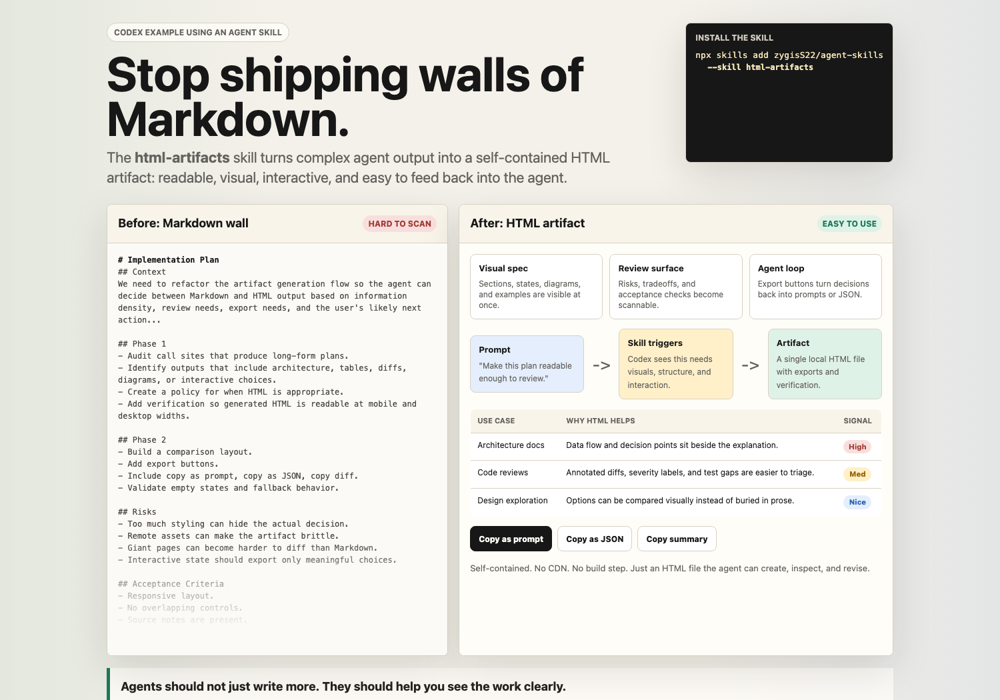
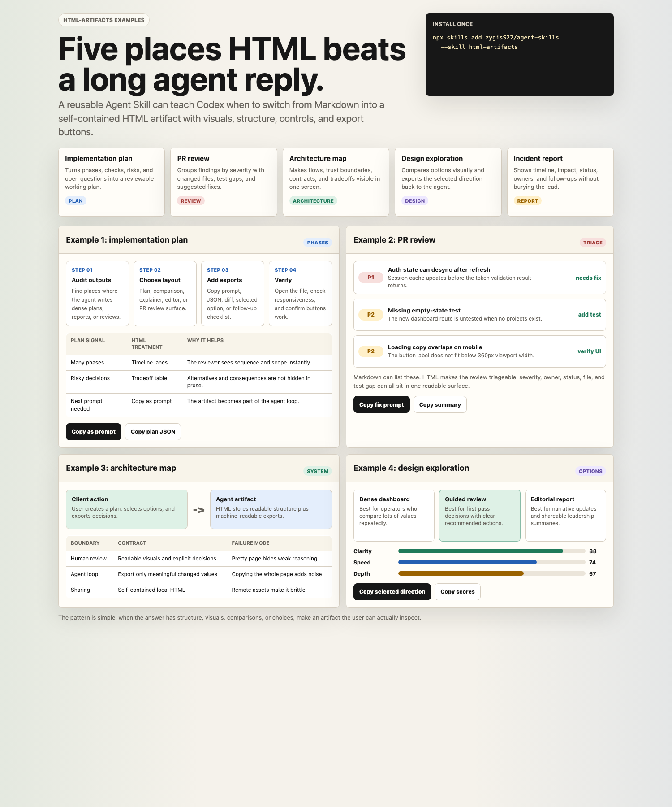

# html-artifacts Examples

These examples show situations where the `html-artifacts` Agent Skill should produce a self-contained HTML file instead of a long Markdown response.

## Included

- `html-artifacts-codex-demo.html`: before/after overview for social posts.
- `html-artifacts-situations-gallery.html`: multiple situations in one artifact, including plans, PR reviews, architecture maps, design exploration, and incident/status report patterns.

## Screenshots





Mobile verification screenshot:

- `html-artifacts-situations-gallery-mobile.png`
- `html-artifacts-situations-gallery-mobile-390.png`

## Install

```bash
npx skills add zygisS22/agent-skills --skill html-artifacts
```
